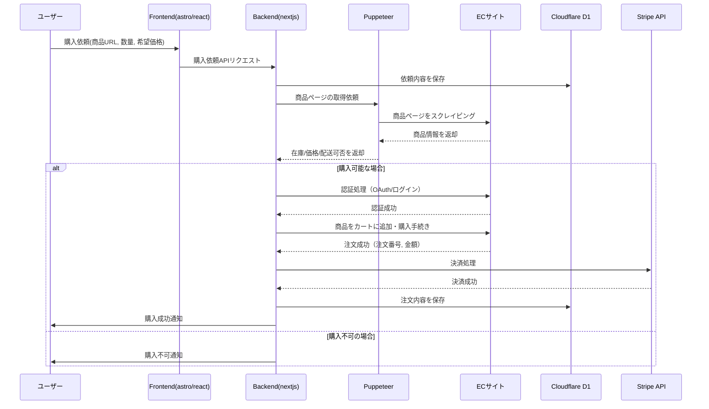
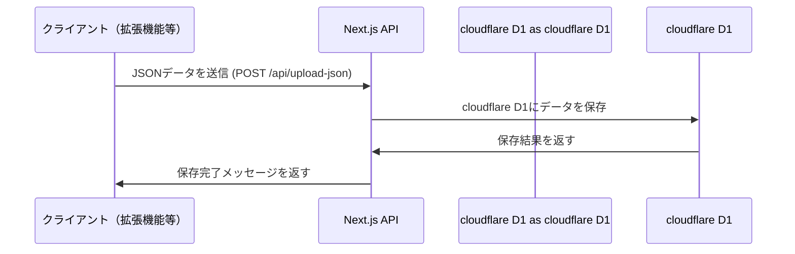
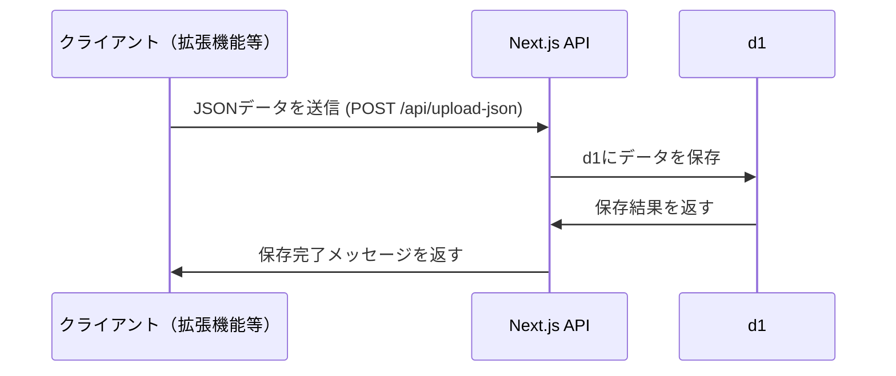
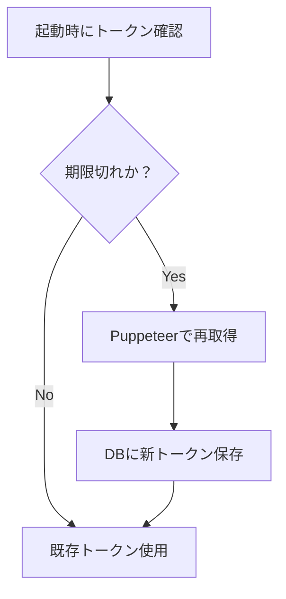
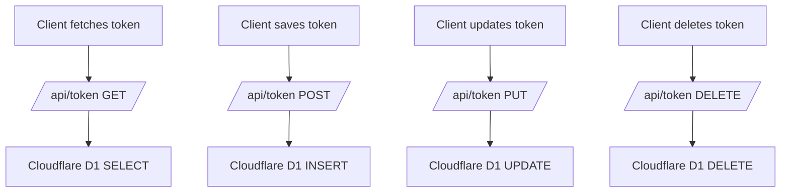
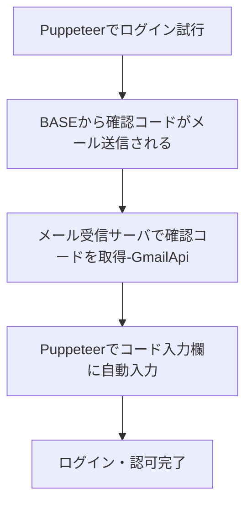
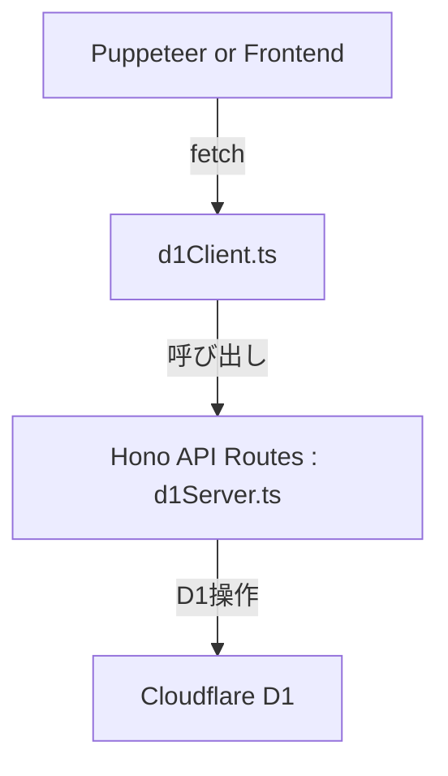
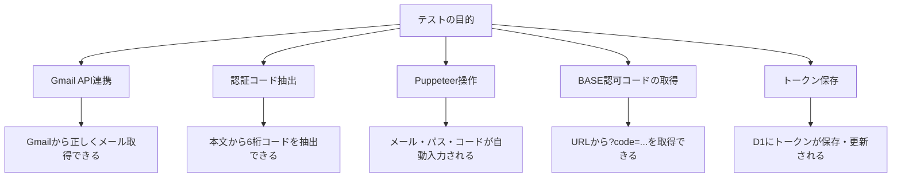
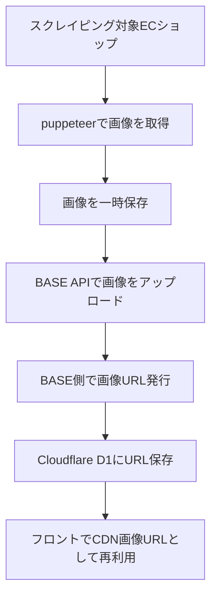
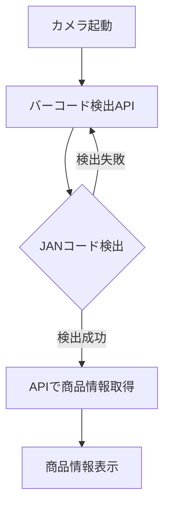

# phis-admin

---

## cloudflare d1

***
### 商品管理テーブル

| 項目 | 説明 |
|------|------|
| **商品ID** *必須 | 商品の一意識別子（ASINなど） |
| **ショップID** *必須 | 商品が所属するECサイト |
| **商品名** *必須 | 商品の名称 |
| **カテゴリ** *必須 | JSON形式でカテゴリ情報を保持 |
| **商品価格** *必須 | 商品の通常価格 |
| **現割引価格** | 割引後の価格 |
| **割引率** | 割引率（%） |
| **割引履歴** | JSON形式で割引履歴を保持 |
| **商品画像** | 商品の画像URL |
| **商品リンク** *必須 | 商品ページのリンク |
| **アソシエイトリンク** | アフィリエイト用のリンク |
| **商品概要** | 商品の説明（段落形式） |
| **平均評価** | ユーザーの平均評価（星評価など） |
| **レビュー数** | レビューの総数 |
| **在庫状況** *必須 | 商品の在庫情報（在庫あり/なしなど） |
| **配送情報** *必須 | 配送に関する情報（配送日数・配送業者など） |
| **販売元** *必須 | 商品の販売元情報 |
| **商品特長** | JSON形式で商品特長を管理 |
| **保証情報** | 保証に関する情報 |
| **可変スペック情報** | JSON形式で可変スペック情報を管理 |
| **獲得ポイント数** | 購入時に獲得できるポイント数 |
| **ポイント還元率** | ポイント還元率（%） |
| **ポイント有効期限** | 獲得ポイントの有効期限 |
| **ポイント獲得の条件** | ポイント獲得に関する条件 |
| **定期便** | 異なる定期おトク便の名称、配送条件、価格、日数、在庫状況、配送頻度を適切に管理 |
| **ブランド名** | 商品のブランド名 |
| **梱包サイズ** | 商品の梱包サイズ |
| **メーカー製造中止** | メーカーによる製造中止情報 |
| **商品タイプ** | 商品の種類（食品、家電、衣類など） |
| **カフェインの有無** | カフェイン含有の有無 |
| **メーカー名** | メーカーの名称 |
| **原産国** | 商品の原産国 |
| **商品の重量（kg）** | 商品の重量（kg単位） |
| **ストア売れ筋ランキング** | ストアでの売れ筋ランキング情報 |
| **ストア取扱開始日** | ストアでの取扱開始日 |
***

スクレイピングデータモデル 
### sites テーブル
| 項目 | 説明 | データ型 |
|------|------|------|
| id | サイト識別子 | string
| name | ECサイト名 | string
| base_url | 基本URL | string
| selectors | スクレイピング用セレクタ情報 | object
| created_at | 作成日時 | datetime

### scraped_products
| 項目 | 説明 | データ型 |
|------|------|------|
| id | 一意の識別子 |	string |
| site_id |	sites テーブルのid |string (relation) |
| product_url |	商品ページURL	| string |
| scraped_data | 取得データ（サイトごとの構造）| object |
| last_scraped_at |	スクレイピング日時 | datetime |


### japan_categories テーブル（日本標準商品分類）
| フィールド | 説明　| データ型　|
|------|------|------|
| `id` | カテゴリID（JSICコード or JICFSコード） | `string` |
| `name` | カテゴリ名 | `string` |
| `parent_category` | 上位カテゴリ（親カテゴリID）| `string` (relation) |
| `level` | 階層レベル（大分類＝1, 中分類＝2, 小分類＝3） | `number` |
| `alternative_names` | 別名（ECサイトごとのカテゴリ名）| `array` |

---

## **1. 概要**
本システムは、複数のECサイトを横断的に管理し、ユーザーの購買活動を一元化するプラットフォームです。ユーザーが優先するECサイトを設定し、商品検索、注文自動化、メール管理、ポイント管理、売上管理などを統合的に提供します。
また、代理購入を横断的にシステム機能として提供。



---

## **2. 機能一覧**
| 機能 | 概要 |
|------|------|
| **商品検索** | 複数のECサイトを横断検索し、価格・在庫情報を取得 |
| **優先EC設定** | ユーザーが優先するECサイトを設定し、検索結果を最適化 |
| **注文自動化** | ECサイトのフォームをスクレイピングし、カート追加・注文入力を自動化 |
| **メール管理** | 各ECサイトの注文メールを一元管理（Gmail API） |
| **ポイント管理** | 各ECサイトのポイントを取得し、ユーザーに提供 |
| **売上管理** | 各ECサイトの売上情報を取得し、統合管理 |
| **API判定** | ECサイトのAPI提供の有無・有料/無料判定を実施 |
| **予約販売判定** | 商品が予約販売かどうかを判別し、データベースに記録 |
| **キャンペーン商品判定** | ユーザーが訪問した商品ページのみにバックグラウンドスクレイピングを実行 |
| **配送状況管理** | 配送情報を取得し、ECごとに記録 |
| **価格比較分析** | 複数販売店の価格をリアルタイムで比較し、最適価格を提示 |
| **レビューと評価管理** | 購入者のレビューを分析し、信頼性の高い情報を提供 |
| **ランキング機能** | 人気商品やトレンドをランキング化し、ユーザーに提案 |
| **商品スペック比較** | 複数商品の仕様や性能を直感的に比較可能にする |
| **外部カート購入** | 複数ECサイトの商品を一括でカートに追加し、購入を最適化 |
| **サービス比較（保険・通信・金融）** | 商品以外のサービス（保険、光回線、クレジットカード等）の比較 |

---

## **3. システムアーキテクチャ**
### **3.1 使用技術**
| 項目 | 使用技術 |
|------|------|
| **フロントエンド** | React (Next.js) |
| **バックエンド** | Node.js (Express) |
| **スクレイピング** | Puppeteer |
| **データベース** | PostgreSQL / MongoDB |
| **認証** | OAuth2 / Firebase Auth |
| **メール管理** | Gmail API / Mailgun |
| **決済管理** | Stripe API |
| **検索エンジン** | Elasticsearch |
| **マップ連携** | Google Maps API |
| **クラウドホスティング** | Indigo Webarea |

---


## **4. 詳細機能仕様**
### **4.1 商品検索と価格比較**
- **複数のECサイト（楽天、Amazon、Yahoo!ショッピングなど）を横断検索**
- **スクレイピング & 公式APIの切り替え対応**
- **商品情報、価格、在庫、ポイント還元率を取得**
- **Google Mapsとの連携による店舗情報の表示**
- **価格推移の可視化、購入タイミングの提案**

### **4.2 注文自動化**
- **フォーム入力の自動化（ログイン、カート追加、注文処理）**
- **CAPTCHA対応（手動認証補助）**
- **注文履歴の管理と統合**

### **4.3 ユーザーレビューと評価管理**
- **購入者のレビューを収集・分析**
- **信頼性の低いレビューをフィルタリング**
- **AIによるレビューの要約と評価スコア算出**

### **4.4 売上管理**
- **注文履歴をスクレイピング or APIで取得**
- **商品ごとの売上情報をデータベースに記録**
- **月別・年別の売上分析**

### **4.5 配送状況管理**
- **配送状況を提供するECサイトを判定**
- **注文履歴ページから配送状況を取得**
- **配送データをデータベースに保存し、ユーザーに提供**

---

## **5. 収益化モデル**
| モデル | 収益化手法 |
|------|------|
| **サブスクリプション課金** | プレミアム機能（月額 ¥980～） |
| **決済手数料** | Stripe決済時に1～5%の手数料を徴収 |
| **アフィリエイト収益** | Amazon、楽天、Yahoo!ショッピング経由の手数料 |
| **スポンサー広告** | 優先ECサイトのプロモーション枠 |
| **企業向けAPI提供** | 商品検索API・売上管理APIの提供（¥10,000/月～） |

---

## **6. まとめ**
- **EC横断型の購入管理を実現**
- **ポイント・売上・配送・注文情報を一元管理**
- **スクレイピング & APIのハイブリッドアプローチで安定運用**
- **収益化モデルを多角的に展開し、ビジネス化を実現**

---

## 価格コム分析
### 商品カテゴリ別の比較機能
#### 目的
ユーザーが特定の製品カテゴリ（家電、PC、スマートフォンなど）の中から商品を比較しやすくする。
#### 特徴
- カテゴリ分類
- 家電、IT関連商品、サービス（保険、旅行など）を細かく分類。
- カテゴリ間の階層が分かりやすく、目的の商品にたどり着きやすい設計。
- フィルター機能
ブランド、価格帯、機能、性能、レビュー評価などで絞り込み可能。
#### 実現方法
- データベース構造：商品情報はカテゴリごとに分割されたテーブルに格納。
- 検索機能：Elasticsearchなどの検索エンジンを使用して高速検索を実現。
### 価格比較
#### 目的
複数の販売店の価格を一覧表示し、最安値を提示。
#### 特徴
- リアルタイム更新
- 各店舗からの価格データをAPIやスクレイピングで定期的に更新。
- 価格推移グラフ
- 過去の価格履歴を可視化し、購入タイミングを判断しやすくする。
#### 実現方法
- 価格データ取得：販売店との提携により、APIを通じて価格データを自動取得。
- 価格更新の効率化：変更が頻繁な商品のみ更新し、全商品の更新負荷を軽減。
### レビューと評価
#### 目的
実際の購入者からのフィードバックを集約し、購入の参考にする。
#### 特徴
- レビューの質を管理
- 購入者のみレビュー可能、または評価に基づくレビューの信頼度ランキング。
- 評価項目の細分化
- 性能、デザイン、使いやすさ、コストパフォーマンスなど多角的な視点。
#### 実現方法
- スパム対策：不正なレビューを検出するため、機械学習やモデレーションシステムを導入。
- レビューデータの活用：レビュー内容を自然言語処理（NLP）で解析し、人気のトピックを可視化。
### ランキング機能
#### 目的
人気商品やトレンド商品を一覧化し、ユーザーに提案。
#### 特徴
- ランキングの多様性
- 売れ筋ランキング、レビュー評価ランキング、価格ランキング。
- パーソナライズ
- ユーザーの閲覧履歴や検索履歴に基づくランキングカスタマイズ。
#### 実現方法
- アルゴリズム：ランキングは閲覧数、購入数、レビュー数などを基にスコアリングして算出。
- AI活用：ユーザーの嗜好に応じたレコメンド。
### 商品のスペック比較
#### 目的
複数商品の仕様や性能を視覚的に比較。
#### 特徴
- スペック表
- 複数商品の性能を表形式で表示。
- 視覚的な差別化
- 重要な違いをハイライト表示し、直感的に理解できる。
#### 実現方法
- データ管理：JSONやスプレッドシート形式でスペックを一元管理。
- 動的比較ツール：Vue.jsやReactなどのフロントエンドフレームワークを活用して、ユーザーインタラクションを向上。
### 購入先リンク
#### 目的
ユーザーが最適な販売店に直接アクセスできるようにする。
#### 特徴
- 販売店情報の充実
- 価格以外に送料、在庫、ポイント還元情報を併記。
- アフィリエイト収益化
- 購入リンクにアフィリエイトコードを付与。
#### 実現方法
- アフィリエイトネットワーク：各販売店との提携による収益化。
- トラッキングツール：Google Analyticsなどでクリック率や購買データを分析。
### 比較ツールのUI/UX
#### 目的
初心者でも簡単に使えるインターフェースを提供。
#### 特徴
- レスポンシブデザイン
- スマートフォンやタブレットにも最適化。
- シンプルで直感的なデザイン
- 比較ボタン、カート追加ボタンが目立つ位置に配置。
#### 実現方法
- フロントエンド技術：React.jsやNext.jsで高性能なUIを構築。
- ユーザビリティテスト：UI改善のために定期的にA/Bテストを実施。
### サービス比較（保険、通信、金融など）
#### 目的
商品だけでなく、サービス（保険、光回線、クレジットカードなど）を比較。
#### 特徴
- プラン別比較
- 月額料金、キャンペーン、利用可能地域などを比較。
- 診断ツール
- ユーザーの入力情報に基づいて最適なプランを提案。
#### 実現方法
- 動的フォーム：リアルタイムで条件を変えられるインターフェース。
- バックエンド処理：複雑な料金体系をスクリプトで計算。
### ユーザーアカウント機能
#### 目的
- ユーザーの利便性を向上させるためのパーソナライズ。
#### 特徴
- お気に入り登録
- 気になる商品を保存。
- 通知機能
- 価格変動やセール情報を通知。
#### 実現方法
- データベース設計：各ユーザーに関連付けたデータを効率的に管理。
- プッシュ通知：FirebaseやSNS連携を活用。

### 比較の問題点
#### 商品毎の価格比較になっている
- 可能であれば商品別に比較を行う
- キャンペーン別に比較を行う
- セール別に比較を行う

### 外部カート商品購入機能
#### 目的
- 外部の複数ECで買い物を行う
#### 特徴
- 外部アカウントの登録
- 指定商品を自動でカートに入れる
- 購入後メールをまとめる
- 住所などを自動入力
- puppeteerを利用
- SSOの利用
- React + Authentication OpenIDConnect 認証

#### コマース
- マルチチャネルコマース (Multi-channel Commerce)
 複数のチャネル（ECサイト、マーケットプレイス、SNSなど）を通じて商品を購入・販売する仕組み。
- クロスモールコマース (Cross-mall Commerce)
 複数のECモール（例：Amazon、楽天、Yahoo!ショッピングなど）をまたいで商品を購入できる仕組み。
- オムニチャネルコマース (Omnichannel Commerce)
 オンライン・オフラインを含むあらゆるチャネルで統合的に商品を購入・提供する仕組み。
- メタショッピング (Meta Shopping)
 複数のECサイトを横断して価格や商品を比較し、購入を支援する仕組み。
- アグリゲートコマース (Aggregate Commerce)
 異なるECプラットフォームの商品を1つのプラットフォームやサービスでまとめて購入可能にする仕組み。

# メールアドレス
###

#threads
##API

https://developers.facebook.com/docs/threads


---

# api
## pages/api/hello.js
- Next.js API route support: [https://nextjs.org/docs/api-routes/introduction](https://nextjs.org/docs/api-routes/introduction)

~~~ js
export default function handler(req, res) {
  res.status(200).json({ name: 'John Doe' })
}
~~~

~~~sh
curl http://localhost:3000/api/hello
{"name":"John Doe"}
~~~

# shopify

# Hydrogen
https://hydrogen.shopify.dev/

---

# branches rule
  - backend_ や frontend_ の接頭辞を使わず、階層的な命名をする
  - 長いブランチ名を避け、ディレクトリ構造と一致させる
  - ケバブケース（-）
  - 例: backend-config-database, frontend-components-layout

---

# prefix branches
- prefix | 各機能や全体をまとめるブランチ(メインブランチ)

main  # 本番環境
  - stagingのデプロイのみの本番環境

staging  # ステージング環境
  - devのデプロイのみのステージング環境

dev  # 開発環境
  - prefixをまとめた、開発環境用のブランチ

---

# github actions
tag.yml: release/ver⚪︎.⚪︎.⚪︎ -> 自動タグ

# git ブランチコミット制限
ブランチ名とファイルパスのルールに違反した場合にエラー

## 正常なケース
ブランチ: src-index.js
変更ファイル:
~~~
src/index.js  ✅ OK
src/utils.js  ✅ OK
~~~

## エラーケース
ブランチ: src-index.js
変更ファイル:
~~~
lib/helper.js ❌ NG (lib/ は src-index.js に対応していない)
🚨 エラー: 'lib/helper.js' は 'src-index.js' の対象フォルダではありません！
   'src' フォルダのファイルのみコミットできます。
~~~

---

# 構成

構成のポイント
	1.	フルスタックアーキテクチャ
	•	バックエンドはNode.js（Express）で構築し、スクレイピング（Puppeteer）やAPIデータ取得を実施。
	•	フロントエンドはReact (Next.js) で構築し、TailwindCSSでデザインを適用。
	•	データベースはmicroCMSを使用して、動的なコンテンツ管理を実現。
	2.	スクレイピング＆APIの自動判定
	•	Puppeteerを活用してECサイトの情報を取得。
	•	各ECサイトのAPIを判定し、利用可否をデータベースに格納。
	3.	一元管理機能
	•	ユーザーごとのGmailアカウントをAPIで管理し、ECサイトの会員登録を統一。
	•	購入履歴・ポイント・配送状況・キャンセル状況をダッシュボードで可視化。
	4.	レコメンド検索機能
	•	優先したECサイトの商品を検索結果で優先的に表示。
	•	Google Maps APIと連携し、リアル店舗の在庫状況を表示。

## system directory
/root
│── /backend
│── /scripts
│── /docs
│── .env
│── .gitignore
│── README.md
│── package.json
│── tsconfig.json
│── docker-compose.yml

---
# backend
## backend構成
/backend
│── /src
  │── /api
  │   │── apiClient.ts        # microCMS APIの接続設定
  │   │── errorHandling.ts
  │   │── puppeteerApi.ts
  │── /config
  │   │── database.ts        # microCMS、Stripe、Gmail APIの接続設定
  │   │── auth.ts            # 認証関連の設定
  │   │── puppeteer.ts       # Puppeteerの設定と制御
  │
  │── /controllers
  │   │── authController.ts      # ECサイトの認証処理
  │   │── purchaseController.ts  # 購入処理（カート追加、決済）
  │   │── scrapingController.ts  # スクレイピング制御
  │   │── emailController.ts     # Gmail API経由でメール取得・解析
  │   │── pointController.ts     # ECポイント情報管理
  │   │── shippingController.ts  # 配送情報取得
  │   │── cancelController.ts    # キャンセル情報取得
  │   │── apiCheckController.ts  # APIの有無、種類の判定
  │
  │── /models
  │   │── User.ts           # ユーザー情報
  │   │── Product.ts        # 商品情報
  │   │── Purchase.ts       # 購入履歴
  │   │── ECAccount.ts      # ECサイトのアカウント情報
  │   │── Point.ts          # ポイント情報
  │   │── Shipping.ts       # 配送状況
  │   │── Favorite.ts       # お気に入り情報
  │   │── APIStatus.ts      # 各ECサイトのAPI情報
  │
  │── /routes
  │   │── authRoutes.ts          # 認証用APIルート
  │   │── purchaseRoutes.ts      # 購入関連API
  │   │── scrapingRoutes.ts      # スクレイピングAPI
  │   │── emailRoutes.ts         # メール管理API
  │   │── pointRoutes.ts         # ポイント管理API
  │   │── shippingRoutes.ts      # 配送管理API
  │   │── cancelRoutes.ts        # キャンセル管理API
  │   │── apiCheckRoutes.ts      # API判定API
  │   │── recommendationRoutes.ts # 検索レコメンドAPI
  │
  │── /services
  │   │── scrapingService.ts  # 各ECサイトのデータ取得サービス
  │   │── authService.ts      # 認証処理のロジック
  │   │── emailService.ts     # Gmail APIの制御
  │   │── pointService.ts     # ポイントの取得・管理
  │   │── shippingService.ts  # 配送状況の取得
  │   │── cancelService.ts    # キャンセル手続きの処理
  │   │── apiCheckService.ts  # APIの判定処理
  │
  │── /utils
  │   │── puppeteerUtils.ts   # Puppeteerのヘルパー関数
  │   │── emailParser.ts      # メール解析ユーティリティ
  │   │── pointCalculator.ts  # ポイント計算ユーティリティ
  │   │── apiChecker.ts       # APIの有無を判定するユーティリティ
  │
│── server.ts        # サーバーの設定・起動スクリプト
│── docs # ドキュメント
│   │── API_Specifications.md # API仕様書
│   │── Database_Schema.md     # データベース設計
│   │── Setup_Guide.md         # 環境構築手順
│   │── Scraping_Guidelines.md # スクレイピングのガイドライン

---

# backend起動方法
### typescriptをビルド
npx tsc

---

# D1起動方法
```
wrangler d1 create pup 
wrangler d1 execute my-database --file=setup.sql
wrangler d1 list 
wrangler dev
wrangler dev src/index.ts
wrangler dev --config wrangler.toml
```

## テーブルが作成されたか確認
```
wrangler d1 execute pup --command="SELECT name FROM sqlite_master WHERE type='table';"
```

## テーブルデータ確認
```
wrangler d1 execute pup --command="SELECT name FROM sqlite_master WHERE type='table';"
```

## リモートデータベース適用
```
wrangler d1 execute pup --file=setup.sql --remote
```

## CURL POST 追加
```
curl -X POST http://localhost:8787/api/contents \
     -H "Content-Type: application/json" \
     -d '{"title":"新規データ","body":"これはテストデータです","visible":true}'
```

## 削除手順
### データーベース全体の削除
※ wrangler からデータベースを削除するコマンドは提供されていない
	1.	Cloudflare Dashboard にログイン
	2.	Workers & Pages → D1 を開く
	3.	pup データベースを選択
	4.	Delete Database (データベースを削除) をクリック
	5.	確認プロンプトに pup を入力し削除

### 特定のテーブルを削除する
```
wrangler d1 execute pup --command="DROP TABLE contents;"
```

### テーブル内のデータのみ削除（初期化）
※ id の AUTOINCREMENT はリセットされない。
```
wrangler d1 execute pup --command="DELETE FROM contents;"
```

### TRUNCATE の代替（完全初期化）
```
wrangler d1 execute pup --command="DELETE FROM contents; VACUUM;"
```

### ローカルデータベースの削除
```
rm -rf .wrangler/state/v3/d1
```


---

# Maintenance (メンテナンス)
maintenance-mode

---

# cloudflare D1にJSONデータを送信するAPI


# D1にJSONデータを送信するAPI


---

# 30日ごとの認可コード再取得


### APIルート


---

# メール確認コードを自動取得・入力する流れ


### 設計


- d1Server.ts: D1のAPIエンドポイント定義 (GET /token, POST /token etc)
- d1Client.ts: fetch を抽象化して API 経由でデータ操作する（再利用性高）
- scrape.ts（Puppeteer等）やフロントエンドから d1Client.ts を呼び出す

### テスト


#### BASE認可コード自動取得処理のテスト手順
1. `.env` が正しいことを確認（GmailとBASE）
2. `fetchVerificationCode()` 単体で認証コードを取得
3. `scrapeBaseAuth()` を実行し、自動ログイン＋認証＋トークン取得を検証
4. Cloudflare D1 のトークン保存が `/api/token` で確認できること
5. エラー時は Puppeteer の操作対象セレクタ・Gmailのメール件名などを見直す

---

# スクレイピングした画像を BASEに登録し、画像をCDNとして再利用する。
- puppeteer: ECショップから画像取得
- backend: BASE API 経由で画像登録
- BASE: 画像ホスティング (CDN的に利用)



---

# タオバオの国際送料計算機
```
project-root/
├── backend/
│   ├── controllers/
│   │   └── shippingController.js
│   ├── services/
│   │   ├── taobaoApiService.js
│   │   └── shippingCalculator.js
│   └── routes/
│       └── shippingRoutes.js
└── frontend/
    ├── components/
    │   └── ShippingCalculator.jsx
    └── pages/
        └── index.jsx
```

---

# JAN CODE API


- JANCODEをAPIで検索して商品情報を取得する機能を実装。
- ブラウザからバーコードを読み取り、JANCODEを取得する機能を実装。
- 使用技術：フロントエンドはReact（Astro）、バックエンドはNode.js、APIは無料の外部JAN検索API、バーコード検出には Barcode Detection API を利用。

	•	JANコード検索API
	•	GET https://www.jancode.xyz/api/jan/{JANコード}
	•	レスポンス：商品名、メーカー、カテゴリなど


---


